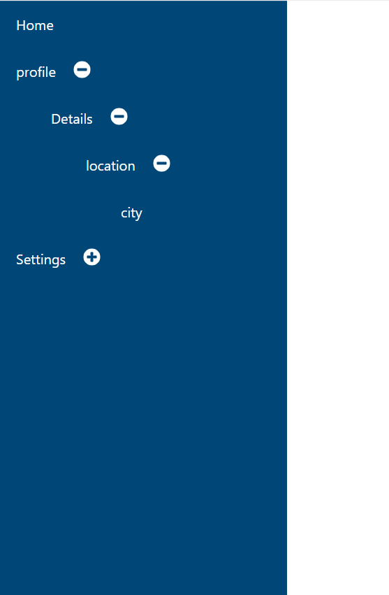

# tree-view

this project display side bar manu

it uses by calling nested component

and by toggling item it used for open and close the 
plus and minus button

it used conditional function to display the childern

the data files containes list of menu

# Function Logic:
Previous State: The prev parameter represents the previous state of displayCurrentChildren.

Spread Operator: ...prev copies all previous state properties.

Toggle State:

[getCurrentlabel]: !prev[getCurrentlabel]

getCurrentlabel is used as the key.

!prev[getCurrentlabel] toggles the boolean value. If it was true, it becomes false, and vice versa.

# page look like 

# Nov 18 2024